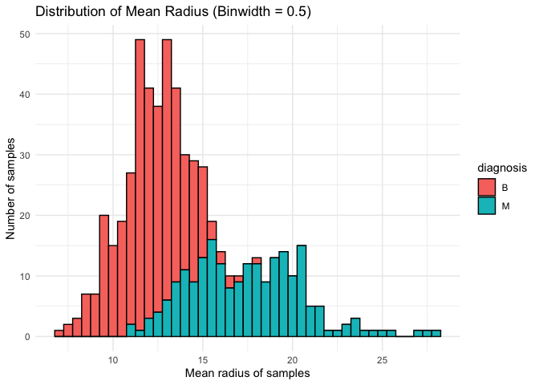
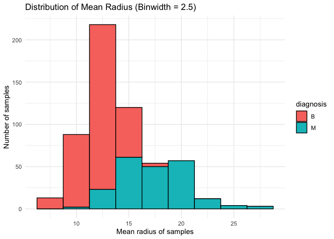
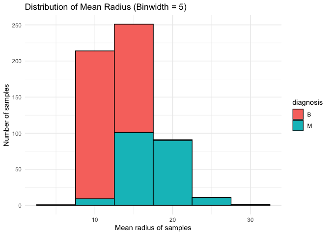
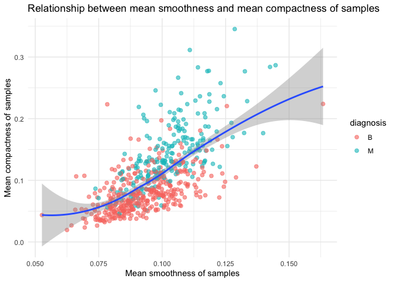
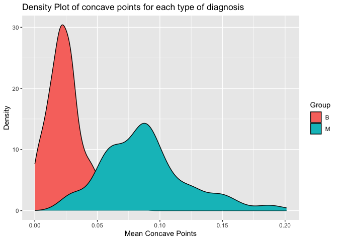
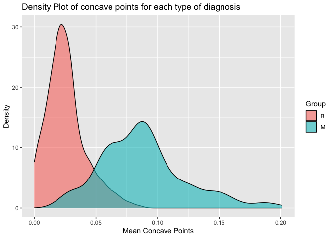
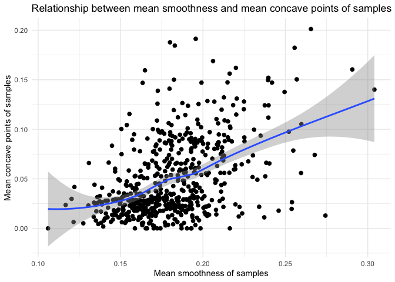
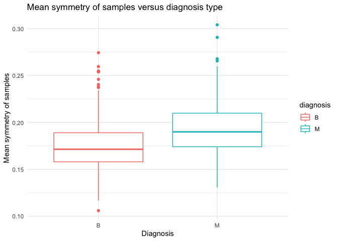
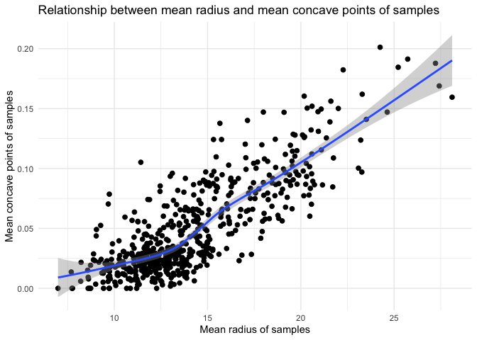

Mini Data Analysis Milestone 2
================

*To complete this milestone, you can either edit [this `.rmd`
file](https://raw.githubusercontent.com/UBC-STAT/stat545.stat.ubc.ca/master/content/mini-project/mini-project-2.Rmd)
directly. Fill in the sections that are commented out with
`<!--- start your work here--->`. When you are done, make sure to knit
to an `.md` file by changing the output in the YAML header to
`github_document`, before submitting a tagged release on canvas.*

# Welcome to the rest of your mini data analysis project!

In Milestone 1, you explored your data. and came up with research
questions. This time, we will finish up our mini data analysis and
obtain results for your data by:

- Making summary tables and graphs
- Manipulating special data types in R: factors and/or dates and times.
- Fitting a model object to your data, and extract a result.
- Reading and writing data as separate files.

We will also explore more in depth the concept of *tidy data.*

**NOTE**: The main purpose of the mini data analysis is to integrate
what you learn in class in an analysis. Although each milestone provides
a framework for you to conduct your analysis, it’s possible that you
might find the instructions too rigid for your data set. If this is the
case, you may deviate from the instructions – just make sure you’re
demonstrating a wide range of tools and techniques taught in this class.

# Instructions

**To complete this milestone**, edit [this very `.Rmd`
file](https://raw.githubusercontent.com/UBC-STAT/stat545.stat.ubc.ca/master/content/mini-project/mini-project-2.Rmd)
directly. Fill in the sections that are tagged with
`<!--- start your work here--->`.

**To submit this milestone**, make sure to knit this `.Rmd` file to an
`.md` file by changing the YAML output settings from
`output: html_document` to `output: github_document`. Commit and push
all of your work to your mini-analysis GitHub repository, and tag a
release on GitHub. Then, submit a link to your tagged release on canvas.

**Points**: This milestone is worth 50 points: 45 for your analysis, and
5 for overall reproducibility, cleanliness, and coherence of the Github
submission.

**Research Questions**: In Milestone 1, you chose two research questions
to focus on. Wherever realistic, your work in this milestone should
relate to these research questions whenever we ask for justification
behind your work. In the case that some tasks in this milestone don’t
align well with one of your research questions, feel free to discuss
your results in the context of a different research question.

# Learning Objectives

By the end of this milestone, you should:

- Understand what *tidy* data is, and how to create it using `tidyr`.
- Generate a reproducible and clear report using R Markdown.
- Manipulating special data types in R: factors and/or dates and times.
- Fitting a model object to your data, and extract a result.
- Reading and writing data as separate files.

# Setup

Begin by loading your data and the tidyverse package below:

``` r
library(datateachr) # <- might contain the data you picked!
library(tidyverse)
```

# Task 1: Process and summarize your data

From milestone 1, you should have an idea of the basic structure of your
dataset (e.g. number of rows and columns, class types, etc.). Here, we
will start investigating your data more in-depth using various data
manipulation functions.

### 1.1 (1 point)

First, write out the 4 research questions you defined in milestone 1
were. This will guide your work through milestone 2:

<!-------------------------- Start your work below ---------------------------->

1.  *Are the malignant cancer sample likely to have larger size (radius,
    perimeter and area) than the one of benign cancer sample?*

2.  *What are the difference between the appearance of malignant and
    benign cancer samples (smoothness, compactness)*

3.  *Does the number of concave points differ between malignant and
    benign cancer samples?/Does larger samples (larger radius) have more
    concave points?*

4.  *Which parameters were used to measure/calculate the values of
    texture, symmetry ans fractional dimension variables? Are these
    three variables related to the type of cancer samples (malignant or
    benign)?*
    <!----------------------------------------------------------------------------->

Here, we will investigate your data using various data manipulation and
graphing functions.

### 1.2 (8 points)

Now, for each of your four research questions, choose one task from
options 1-4 (summarizing), and one other task from 4-8 (graphing). You
should have 2 tasks done for each research question (8 total). Make sure
it makes sense to do them! (e.g. don’t use a numerical variables for a
task that needs a categorical variable.). Comment on why each task helps
(or doesn’t!) answer the corresponding research question.

Ensure that the output of each operation is printed!

Also make sure that you’re using dplyr and ggplot2 rather than base R.
Outside of this project, you may find that you prefer using base R
functions for certain tasks, and that’s just fine! But part of this
project is for you to practice the tools we learned in class, which is
dplyr and ggplot2.

**Summarizing:**

1.  Compute the *range*, *mean*, and *two other summary statistics* of
    **one numerical variable** across the groups of **one categorical
    variable** from your data.
2.  Compute the number of observations for at least one of your
    categorical variables. Do not use the function `table()`!
3.  Create a categorical variable with 3 or more groups from an existing
    numerical variable. You can use this new variable in the other
    tasks! *An example: age in years into “child, teen, adult, senior”.*
4.  Compute the proportion and counts in each category of one
    categorical variable across the groups of another categorical
    variable from your data. Do not use the function `table()`!

**Graphing:**

6.  Create a graph of your choosing, make one of the axes logarithmic,
    and format the axes labels so that they are “pretty” or easier to
    read.
7.  Make a graph where it makes sense to customize the alpha
    transparency.

Using variables and/or tables you made in one of the “Summarizing”
tasks:

8.  Create a graph that has at least two geom layers.
9.  Create 3 histograms, with each histogram having different sized
    bins. Pick the “best” one and explain why it is the best.

Make sure it’s clear what research question you are doing each operation
for!

<!------------------------- Start your work below ----------------------------->

### Loading the package

In this project, we will use the dplyr, gglot2 and tidyr packages
included in the tidyverse packages. `dplyr` is used for data wrangling,
`ggplot2` is used for data visualization and `tidyr` is used for data
cleaning.

``` r
library(tidyverse)
```

#### Question 1: Are the malignant cancer sample likely to have larger size (radius, perimeter and area) than the one of benign cancer sample?

###### 1. Summarizing

Compute the *range*, *mean*, and *two other summary statistics* of **one
numerical variable** across the groups of **one categorical variable**
from your data.

In the question, I mentioned three variables (radius, perimeter and
area), I will compute for the radius as an example in this case because
perimeter and area are calculated based on radius.

``` r
radius_stat<- cancer_sample %>% 
              group_by(diagnosis)%>%
              summarise(rad_min = min(radius_mean),
                      rad_max = max(radius_mean),
                      rad_mean = mean(radius_mean), 
                      rad_sd  = sd(radius_mean))
                     
print(radius_stat)
```

    ## # A tibble: 2 × 5
    ##   diagnosis rad_min rad_max rad_mean rad_sd
    ##   <chr>       <dbl>   <dbl>    <dbl>  <dbl>
    ## 1 B            6.98    17.8     12.1   1.78
    ## 2 M           11.0     28.1     17.5   3.20

These data can directly give us an overview when comparing radius_mean
of each type of diagnosis (B =benign and M= malignant). By looking at
the values of min value, max value and mean value of radius, we can see
that the radius of benign cancer samples are generally smaller than the
malignant ones.

###### 2. Graphing:

Create 3 histograms, with each histogram having different sized bins.
Pick the “best” one and explain why it is the best.

##### Binwidth = 0.5

``` r
ggplot(cancer_sample,aes(x=radius_mean)) + # created the dataset and variable
  #modified binwidth/ colors to make graph look nicer
  geom_histogram(aes(fill=diagnosis),binwidth=0.5,color="black") +
  xlab("Mean radius of samples") + # added x-axis label
  ylab("Number of samples")+  # added y-axis label 
  labs(title="Distribution of Mean Radius (Binwidth = 0.5)")+ # aaded main title
  theme_minimal() # for minimalistic and clean design
```

<!-- -->

##### Binwidth = 2.5

``` r
ggplot(cancer_sample,aes(x=radius_mean)) + # created the dataset and variable
  #modified binwidth/ colors to make graph look nicer
  geom_histogram(aes(fill=diagnosis),binwidth=2.5,color="black") +
  xlab("Mean radius of samples") + # added x-axis label
  ylab("Number of samples")+  # added y-axis label 
  labs(title="Distribution of Mean Radius (Binwidth = 2.5) ")+ # aaded main title
  theme_minimal() # for minimalistic and clean design
```

<!-- -->

##### Binwidth = 5

``` r
ggplot(cancer_sample,aes(x=radius_mean)) + # created the dataset and variable
  #modified binwidth/ colors to make graph look nicer
  geom_histogram(aes(fill=diagnosis),binwidth=5,color="black") +
  xlab("Mean radius of samples") + # added x-axis label
  ylab("Number of samples")+  # added y-axis label 
  labs(title="Distribution of Mean Radius (Binwidth = 5) ")+ # aaded main title
  theme_minimal() # for minimalistic and clean design
```

<!-- -->

The binwidth = 0.5 is the best option when it can offers a detailed
information of the radius value’s range. Binwidth = 2.5 is still good to
look at but some information is lost. Binwidth = 5 is too large and hard
to see

#### Question 2: What are the difference between the appearance of malignant and benign cancer samples (smoothness, compactness)

###### 1. Summarizing

Create a categorical variable with 3 or more groups from an existing
numerical variable. You can use this new variable in the other tasks!
\*An example: age in years into “child, teen, adult, senior”.

In the question, I mentioned two variables (smoothness, compactness), I
will compute for the smoothness variable as an example in this case. I
want to create 4 groups of smoothness levels: low, fair, good and very
good. To determine the threshold of each level. I calculated the
minimum, first quartile (Q1), median (Q2), mean, third quartile (Q3),
and maximum values for smoothness variable.

``` r
summary(cancer_sample$smoothness_mean)
```

    ##    Min. 1st Qu.  Median    Mean 3rd Qu.    Max. 
    ## 0.05263 0.08637 0.09587 0.09636 0.10530 0.16340

``` r
smooth_level <- cancer_sample %>%
                mutate(smooth_level = case_when(smoothness_mean < 0.08637 ~ "low",
                                                smoothness_mean < 0.09587 ~ "fair",
                                                smoothness_mean < 0.10530 ~ "good",
                                                TRUE ~ "very high")) 

print(smooth_level[, c("smoothness_mean", "smooth_level")])
```

    ## # A tibble: 569 × 2
    ##    smoothness_mean smooth_level
    ##              <dbl> <chr>       
    ##  1          0.118  very high   
    ##  2          0.0847 low         
    ##  3          0.110  very high   
    ##  4          0.142  very high   
    ##  5          0.100  good        
    ##  6          0.128  very high   
    ##  7          0.0946 fair        
    ##  8          0.119  very high   
    ##  9          0.127  very high   
    ## 10          0.119  very high   
    ## # ℹ 559 more rows

By creating this new categorical column, a bar chart or boxplot can help
us visualize the distribution of smoothness level between two type of
diagnosis.

###### 2. Graphing:

Create a graph that has at least two geom layers.

``` r
ggplot(cancer_sample,aes(x=smoothness_mean, y=compactness_mean))+ # set variable for each axis
  # set the color by type of diagnosis (B=Benign, M = Malignant)
  geom_point(aes(color = diagnosis), size = 2, alpha = 0.6) + 
  geom_smooth()+ # added smooth line to clearly show the relationship 
  xlab("Mean smoothness of samples") + # added x-axis label
  ylab("Mean compactness of samples")+  # added y-axis label 
  labs(title="Relationship between mean smoothness and mean compactness of samples ") + # aaded title
  theme_minimal() 
```

    ## `geom_smooth()` using method = 'loess' and formula = 'y ~ x'

<!-- -->

This exercise is to answer the relationship between smoothness_mean and
compactness_mean. Based on this graph we can see a slightly proportional
relationship between smoothness and compactness.

Besides, we also realize that: - for smoothness: there is no significant
difference in smoothness between the benign samples and malignant
samples - for the compactness: the benign samples have lower compactness
compared to the malignant ones.

#### Question 3: Does the number of concave points differ between malignant and benign cancer samples?/Does larger samples (larger radius) have more concave points?\*

These two questions are similar and I want to explain why I put these
two together. In the question 1: Are the malignant cancer sample likely
to have larger size (radius, perimeter and area) than the one of benign
cancer sample? We have some evidence that the malignant cancer sample
are generally larger than benign samples. Therefore, I want to see the
difference in concave points number between malignant and benign samples
to see if larger radius samples (malignant ones) have more concave
points than the smaller radius (benign) samples.

###### 1. Summarizing

Compute the *range*, *mean*, and *two other summary statistics* of **one
numerical variable** across the groups of **one categorical variable**
from your data

``` r
concave_points_stats<- cancer_sample %>% 
              group_by(diagnosis)%>%
              summarise(rad_min = min(concave_points_mean),
                      rad_max = max(concave_points_mean),
                      rad_mean = mean(concave_points_mean), 
                      rad_sd  = sd(concave_points_mean))
print(concave_points_stats)
```

    ## # A tibble: 2 × 5
    ##   diagnosis rad_min rad_max rad_mean rad_sd
    ##   <chr>       <dbl>   <dbl>    <dbl>  <dbl>
    ## 1 B          0       0.0853   0.0257 0.0159
    ## 2 M          0.0203  0.201    0.0880 0.0344

These data can directly give us an overview when comparing number of
concave points of each type of diagonsis (B =benign and M= malignant).

By looking at the values of min value, max value and mean value of
concave points, we can see that the benign cancer samples have less
concave points than the malignant ones.

###### 2. Graphing:

Make a graph where it makes sense to customize the alpha transparency

``` r
ggplot(cancer_sample, aes(x = concave_points_mean, fill = diagnosis)) +
  geom_density(alpha = 1) +
  labs(title = "Density Plot of concave points for each type of diagnosis", x = "Mean Concave Points", y = "Density") +
  scale_fill_discrete(name = "Group")
```

<!-- -->

If the transparency (alpha = 1), the graph is difficult to see. Change
to transparency to 0.5 or 0.6 will make the graph look nicer (graph
shown below)

``` r
ggplot(cancer_sample, aes(x = concave_points_mean, fill = diagnosis)) +
  geom_density(alpha = 0.6) +
  labs(title = "Density Plot of concave points for each type of diagnosis", x = "Mean Concave Points", y = "Density") +
  scale_fill_discrete(name = "Group")
```

<!-- -->

Once again, by looking at this graph, we can see that the benign cancer
samples have less concave points than the malignant ones.

#### Question 4: Which parameters were used to measure/calculate the values of texture, symmetry and fractional dimension variables? Are these three variables related to the type of cancer samples (malignant or benign)?

I did a research on which parameters are used to measure or calculate
the values of texture, symmetry and fractional dimension variables on
UCI Machine Learning Repository, however, there is no information about
this. Therefore, I will work with the latter question: Are these three
variables related to the type of cancer samples (malignant or benign). I
will choose to work with symmetry variable as an example.

The approach is similar to what we have done with radius, smoothness,
compactness or concave points. My goal for this data analysis is to
understand the difference between benign and malignant cancer samples
based on the provided variables.

###### 1. Summarizing

Create a categorical variable with 3 or more groups from an existing
numerical variable. You can use this new variable in the other tasks!
*An example: age in years into “child, teen, adult, senior”.*

Since my original dataset only contain one catogorical variable
(diagnosis), therefore, I want to create a new categorical variable as
symmetry levels: low, moderate, high and very high. To determine the
threshold of each level. I calculated the minimum, first quartile (Q1),
median (Q2), mean, third quartile (Q3), and maximum values for symmetry
variable.

``` r
summary(cancer_sample$symmetry_mean)
```

    ##    Min. 1st Qu.  Median    Mean 3rd Qu.    Max. 
    ##  0.1060  0.1619  0.1792  0.1812  0.1957  0.3040

``` r
symmetry_level <- cancer_sample %>%
                mutate(symmetry_level = case_when(symmetry_mean < 0.1619 ~ "low",
                                                symmetry_mean < 0.1792 ~ "moderate",
                                                symmetry_mean < 0.1957 ~ "good",
                                                TRUE ~ "very good")) 

print(symmetry_level[, c("symmetry_mean", "symmetry_level")])
```

    ## # A tibble: 569 × 2
    ##    symmetry_mean symmetry_level
    ##            <dbl> <chr>         
    ##  1         0.242 very good     
    ##  2         0.181 good          
    ##  3         0.207 very good     
    ##  4         0.260 very good     
    ##  5         0.181 good          
    ##  6         0.209 very good     
    ##  7         0.179 good          
    ##  8         0.220 very good     
    ##  9         0.235 very good     
    ## 10         0.203 very good     
    ## # ℹ 559 more rows

###### 2. Graphing

Create a graph that has at least two geom layers.

The symmetry variable seems vague to us when we do not know this
variable is measure. Therefore, I want to see the relationship between
symmetry and other number of concave points.

``` r
ggplot(cancer_sample,aes(x=symmetry_mean, y= concave_points_mean))+ # set variable for each axis
  geom_point(size = 2) +
  geom_smooth()+ # added smooth line to clearly show the relationship 
  xlab("Mean smoothness of samples") + # added x-axis label
  ylab("Mean concave points of samples")+  # added y-axis label 
  labs(title="Relationship between mean smoothness and mean concave points of samples ") + # aaded title
  theme_minimal() 
```

    ## `geom_smooth()` using method = 'loess' and formula = 'y ~ x'

<!-- -->

Based on the graph above, we do not see a clear relationship between
these two variables.

Besides, I also want to see if there is any difference in the symmetry
level between two types of diagnosis by plotting the boxplot graph.

``` r
ggplot(cancer_sample, aes(x= diagnosis, y = symmetry_mean,colour = diagnosis)) +
  geom_boxplot()+
  xlab("Diagnosis") + # added x-axis label
  ylab("Mean symmetry of samples")+  # added y-axis label 
  labs(title="Mean symmetry of samples versus diagnosis type ") + # aaded main title
  theme_minimal()
```

<!-- -->

Based on the graph above, the benign samples seem to be less symmetric
than the malignant ones. However, the difference is not significant.

<!----------------------------------------------------------------------------->

### 1.3 (2 points)

Based on the operations that you’ve completed, how much closer are you
to answering your research questions? Think about what aspects of your
research questions remain unclear. Can your research questions be
refined, now that you’ve investigated your data a bit more? Which
research questions are yielding interesting results?

<!------------------------- Write your answer here ---------------------------->

**Question1: Are the malignant cancer sample likely to have larger size
(radius, perimeter and area) than the one of benign cancer sample?**

I only worked with radius variable in the part 1.2 as an example because
perimeter and area are calculated based on radius. We can clearly see
that benign samples have smaller radius than malignant. Therefore, the
malignant samples are likely to have larger size (radius, perimeter and
area) than the benign ones

**Question 2: What are the difference between the appearance of
malignant and benign cancer samples (smoothness, compactness)**

Based on this graph we can see a proportional relationship between
smoothness and compactness. Besides, we also realize that:

- for smoothness: there is no significant difference in smoothness
  between the benign samples and malignant samples

- for the compactness: the benign samples have lower compactness
  compared to the malignant ones.

**Question 3: Does the number of concave points differ between malignant
and benign cancer samples?/Does larger samples (larger radius) have more
concave points?**

These data obtain the part 1.2 can directly give us an overview when
comparing number of concave points of each type of diagnosis (B =benign
and M= malignant). By looking at the values of min value, max value and
mean value of concave points, we can see that the benign cancer samples
have less concave points than the malignant ones.

Since the malignant samples are shown to have larger radius than benign
samples (results in question 1), we can rephrase the results that that
larger radius samples (malignant) are likely to have more concave points
than smaller radius sample (benign).

**Question 4:Which parameters were used to measure/calculate the values
of texture, symmetry ans fractional dimension variables? Are these three
variables related to the type of cancer samples (malignant or benign)?**

Based on the graph above, the benign samples seem to be less symmetric
than the malignant ones. However, the difference is not significant.

Besides, the texture and fractional dimension variables are still
remained unclear to us because we do not know which parameters are used
to measure or calculate the values. I took a look on UCI Machine
Learning Repository where the database was downloaded, however, there is
no information about this. Therefore, it is difficult to understand and
compare these two variables between two types of diagnosis.
<!----------------------------------------------------------------------------->

# Task 2: Tidy your data

In this task, we will do several exercises to reshape our data. The goal
here is to understand how to do this reshaping with the `tidyr` package.

A reminder of the definition of *tidy* data:

- Each row is an **observation**
- Each column is a **variable**
- Each cell is a **value**

### 2.1 (2 points)

Based on the definition above, can you identify if your data is tidy or
untidy? Go through all your columns, or if you have \>8 variables, just
pick 8, and explain whether the data is untidy or tidy.

<!--------------------------- Start your work below --------------------------->

First, we will create a subset data with first 8 variables of the
cancer_sample database since my data has more than 8 variables.

``` r
cancer_subset<-cancer_sample[,1:8]
head(cancer_subset)
```

    ## # A tibble: 6 × 8
    ##         ID diagnosis radius_mean texture_mean perimeter_mean area_mean
    ##      <dbl> <chr>           <dbl>        <dbl>          <dbl>     <dbl>
    ## 1   842302 M                18.0         10.4          123.      1001 
    ## 2   842517 M                20.6         17.8          133.      1326 
    ## 3 84300903 M                19.7         21.2          130       1203 
    ## 4 84348301 M                11.4         20.4           77.6      386.
    ## 5 84358402 M                20.3         14.3          135.      1297 
    ## 6   843786 M                12.4         15.7           82.6      477.
    ## # ℹ 2 more variables: smoothness_mean <dbl>, compactness_mean <dbl>

Now we will go through each criteria to see if our data is tidy or
untidy.

**1. Each row is an observation**:

``` r
length(unique(cancer_subset$ID)) #how many samples in the database
```

    ## [1] 569

``` r
nrow(cancer_subset) # how many rows in the database
```

    ## [1] 569

We can see that the number of rows is same as number of samples in
database so each row in th data is an observation

**2. Each column is a variable**:

``` r
num_variables <- ncol(cancer_subset) #how many columns in the database
print(num_variables)
```

    ## [1] 8

``` r
names(cancer_subset) #name all the variables of database
```

    ## [1] "ID"               "diagnosis"        "radius_mean"      "texture_mean"    
    ## [5] "perimeter_mean"   "area_mean"        "smoothness_mean"  "compactness_mean"

We have 8 variables and each of these have it own respective column.

**3. Each cell is a value**:

Each cell in the database contain only one value corresponding to the
one sample and one variable.

Based on three criteria above, the cancer_subset is tidy (the
cancer_sample is tidy as well because cancer_subset is its subset
database and they have same structure).
<!----------------------------------------------------------------------------->

### 2.2 (4 points)

Now, if your data is tidy, untidy it! Then, tidy it back to it’s
original state.

If your data is untidy, then tidy it! Then, untidy it back to it’s
original state.

Be sure to explain your reasoning for this task. Show us the “before”
and “after”.

<!--------------------------- Start your work below --------------------------->

My data is tidy, therefore, I will untidy it and then tidy again.

#### Orginal data

``` r
head(cancer_subset)
```

    ## # A tibble: 6 × 8
    ##         ID diagnosis radius_mean texture_mean perimeter_mean area_mean
    ##      <dbl> <chr>           <dbl>        <dbl>          <dbl>     <dbl>
    ## 1   842302 M                18.0         10.4          123.      1001 
    ## 2   842517 M                20.6         17.8          133.      1326 
    ## 3 84300903 M                19.7         21.2          130       1203 
    ## 4 84348301 M                11.4         20.4           77.6      386.
    ## 5 84358402 M                20.3         14.3          135.      1297 
    ## 6   843786 M                12.4         15.7           82.6      477.
    ## # ℹ 2 more variables: smoothness_mean <dbl>, compactness_mean <dbl>

Here, we can see three criteria in a tidy data: each row is an
**observation**, each column is a **variable** and each cell is a
**value**.

#### Untidy the data

``` r
cancer_untidy <- cancer_sample %>% 
  pivot_longer(cols = c(radius_mean:fractal_dimension_worst), 
               names_to  = c("Measured Variables"), 
               values_to = c("Values")) 

head(cancer_untidy)
```

    ## # A tibble: 6 × 4
    ##       ID diagnosis `Measured Variables`   Values
    ##    <dbl> <chr>     <chr>                   <dbl>
    ## 1 842302 M         radius_mean            18.0  
    ## 2 842302 M         texture_mean           10.4  
    ## 3 842302 M         perimeter_mean        123.   
    ## 4 842302 M         area_mean            1001    
    ## 5 842302 M         smoothness_mean         0.118
    ## 6 842302 M         compactness_mean        0.278

As we can see now in the table above, when we untidy the data, the
number of rows increases and the multiple rows describe one
sample/observation instead of one row for each sample/observation.

#### Now we tidy the data again:

``` r
cancer_tidy <-cancer_untidy %>% 
    pivot_wider(names_from = "Measured Variables",
                values_from = "Values")
print(cancer_tidy)
```

    ## # A tibble: 569 × 32
    ##          ID diagnosis radius_mean texture_mean perimeter_mean area_mean
    ##       <dbl> <chr>           <dbl>        <dbl>          <dbl>     <dbl>
    ##  1   842302 M                18.0         10.4          123.      1001 
    ##  2   842517 M                20.6         17.8          133.      1326 
    ##  3 84300903 M                19.7         21.2          130       1203 
    ##  4 84348301 M                11.4         20.4           77.6      386.
    ##  5 84358402 M                20.3         14.3          135.      1297 
    ##  6   843786 M                12.4         15.7           82.6      477.
    ##  7   844359 M                18.2         20.0          120.      1040 
    ##  8 84458202 M                13.7         20.8           90.2      578.
    ##  9   844981 M                13           21.8           87.5      520.
    ## 10 84501001 M                12.5         24.0           84.0      476.
    ## # ℹ 559 more rows
    ## # ℹ 26 more variables: smoothness_mean <dbl>, compactness_mean <dbl>,
    ## #   concavity_mean <dbl>, concave_points_mean <dbl>, symmetry_mean <dbl>,
    ## #   fractal_dimension_mean <dbl>, radius_se <dbl>, texture_se <dbl>,
    ## #   perimeter_se <dbl>, area_se <dbl>, smoothness_se <dbl>,
    ## #   compactness_se <dbl>, concavity_se <dbl>, concave_points_se <dbl>,
    ## #   symmetry_se <dbl>, fractal_dimension_se <dbl>, radius_worst <dbl>, …

By using pivot_wider(), I was able to edit the data to be tidy again
(original format: each row is an **observation**, each column is a
**variable** and each cell is a **value**).

<!----------------------------------------------------------------------------->

### 2.3 (4 points)

Now, you should be more familiar with your data, and also have made
progress in answering your research questions. Based on your interest,
and your analyses, pick 2 of the 4 research questions to continue your
analysis in the remaining tasks:

<!-------------------------- Start your work below ---------------------------->

1.  *Are the malignant cancer sample likely to have larger size (radius,
    perimeter and area) than the one of benign cancer sample?*

2.  *Does the number of concave points differ between malignant and
    benign cancer samples?/Are the larger radius sample likely to have
    more concave points than the smaller radius cancer sample?*
    <!----------------------------------------------------------------------------->

Explain your decision for choosing the above two research questions.
<!--------------------------- Start your work below --------------------------->

- For the first question, I can see a clear relationship between the
  size of samples and the type of diagnosis. I want to further
  investigate this hypothesis with different types of
  modelling/statistical testing.

- For the second question, I can also see that the difference in the
  number of concave points between two types of diagnosis. It is
  predicted that there is a proportional relationship between
  radius_mean and concave_point_mean. It is a good option to do more
  modelling (regression model) or other statistical test on this
  prediction.
  <!----------------------------------------------------------------------------->

Now, try to choose a version of your data that you think will be
appropriate to answer these 2 questions. Use between 4 and 8 functions
that we’ve covered so far (i.e. by filtering, cleaning, tidy’ing,
dropping irrelevant columns, etc.).

(If it makes more sense, then you can make/pick two versions of your
data, one for each research question.)
<!--------------------------- Start your work below --------------------------->

**Currently, I have not used the se values and the worst values in my
analysis yet. Therefore, I want to create a subset of cancer_sample data
which only contains the mean values.**

**For question 1: radius_mean variable**

``` r
summary(cancer_sample$radius_mean) # quartiles values to create categorical variables based on radius_mean
```

    ##    Min. 1st Qu.  Median    Mean 3rd Qu.    Max. 
    ##   6.981  11.700  13.370  14.127  15.780  28.110

``` r
cancer_radius <- cancer_sample %>% 
  select(ends_with("mean")) %>% #only select the variables which end with 'mean'
  filter(!is.na(radius_mean)) %>%  # filter NA values in radius_mean column
  arrange(radius_mean) %>% #sort the value from smallest to largest
  mutate(radius_size = case_when(radius_mean < 11.700 ~ "small",
                                                radius_mean < 14.127 ~ "medium",
                                                radius_mean < 15.780 ~ "large",
                                                TRUE ~ "very large")) 
glimpse(cancer_radius)
```

    ## Rows: 569
    ## Columns: 11
    ## $ radius_mean            <dbl> 6.981, 7.691, 7.729, 7.760, 8.196, 8.219, 8.571…
    ## $ texture_mean           <dbl> 13.43, 25.44, 25.49, 24.54, 16.84, 20.70, 13.10…
    ## $ perimeter_mean         <dbl> 43.79, 48.34, 47.98, 47.92, 51.71, 53.27, 54.53…
    ## $ area_mean              <dbl> 143.5, 170.4, 178.8, 181.0, 201.9, 203.9, 221.3…
    ## $ smoothness_mean        <dbl> 0.11700, 0.08668, 0.08098, 0.05263, 0.08600, 0.…
    ## $ compactness_mean       <dbl> 0.07568, 0.11990, 0.04878, 0.04362, 0.05943, 0.…
    ## $ concavity_mean         <dbl> 0.000000, 0.092520, 0.000000, 0.000000, 0.01588…
    ## $ concave_points_mean    <dbl> 0.000000, 0.013640, 0.000000, 0.000000, 0.00591…
    ## $ symmetry_mean          <dbl> 0.1930, 0.2037, 0.1870, 0.1587, 0.1769, 0.2222,…
    ## $ fractal_dimension_mean <dbl> 0.07818, 0.07751, 0.07285, 0.05884, 0.06503, 0.…
    ## $ radius_size            <chr> "small", "small", "small", "small", "small", "s…

**For question 2: Concave_points_mean variable**

``` r
summary(cancer_sample$concave_points_mean) # quartiles values to create categorical variables based on concave_points_mean
```

    ##    Min. 1st Qu.  Median    Mean 3rd Qu.    Max. 
    ## 0.00000 0.02031 0.03350 0.04892 0.07400 0.20120

``` r
cancer_concave <- cancer_sample %>% 
  select(ends_with("mean")) %>% #only select the variables which end with 'mean'
  filter(!is.na(concave_points_mean)) %>%  # filter NA values in concave_points_mean column
  arrange(concave_points_mean) %>% #sort the value from smallest to largest
  mutate(concave_points_level = case_when(concave_points_mean < 0.02031 ~ "small",
                                                concave_points_mean < 0.04892 ~ "medium",
                                                concave_points_mean < 0.07400 ~ "large",
                                                TRUE ~ "very large")) 
glimpse(cancer_concave)
```

    ## Rows: 569
    ## Columns: 11
    ## $ radius_mean            <dbl> 6.981, 9.738, 10.660, 8.671, 9.720, 8.597, 8.73…
    ## $ texture_mean           <dbl> 13.43, 11.97, 15.15, 14.45, 18.22, 18.60, 16.84…
    ## $ perimeter_mean         <dbl> 43.79, 61.24, 67.49, 54.42, 60.73, 54.09, 55.27…
    ## $ area_mean              <dbl> 143.5, 288.5, 349.6, 227.2, 288.1, 221.2, 234.3…
    ## $ smoothness_mean        <dbl> 0.11700, 0.09250, 0.08792, 0.09138, 0.06950, 0.…
    ## $ compactness_mean       <dbl> 0.07568, 0.04102, 0.04302, 0.04276, 0.02344, 0.…
    ## $ concavity_mean         <dbl> 0.0000000, 0.0000000, 0.0000000, 0.0000000, 0.0…
    ## $ concave_points_mean    <dbl> 0.000000, 0.000000, 0.000000, 0.000000, 0.00000…
    ## $ symmetry_mean          <dbl> 0.1930, 0.1903, 0.1928, 0.1722, 0.1653, 0.2163,…
    ## $ fractal_dimension_mean <dbl> 0.07818, 0.06422, 0.05975, 0.06724, 0.06447, 0.…
    ## $ concave_points_level   <chr> "small", "small", "small", "small", "small", "s…

# Task 3: Modelling

## 3.0 (no points)

Pick a research question from 1.2, and pick a variable of interest
(we’ll call it “Y”) that’s relevant to the research question. Indicate
these.

<!-------------------------- Start your work below ---------------------------->

**Research Question**: Are the larger radius samples likely to have more
concave points than the smaller radius cancer samples?

**Variable of interest**: Response variable: Concave_points_mean.
Explanatory variable: Radius_mean
<!----------------------------------------------------------------------------->

## 3.1 (3 points)

Fit a model or run a hypothesis test that provides insight on this
variable with respect to the research question. Store the model object
as a variable, and print its output to screen. We’ll omit having to
justify your choice, because we don’t expect you to know about model
specifics in STAT 545.

- **Note**: It’s OK if you don’t know how these models/tests work. Here
  are some examples of things you can do here, but the sky’s the limit.

  - You could fit a model that makes predictions on Y using another
    variable, by using the `lm()` function.
  - You could test whether the mean of Y equals 0 using `t.test()`, or
    maybe the mean across two groups are different using `t.test()`, or
    maybe the mean across multiple groups are different using `anova()`
    (you may have to pivot your data for the latter two).
  - You could use `lm()` to test for significance of regression
    coefficients.

<!-------------------------- Start your work below ---------------------------->

We will fit a linear regression between concave_points_mean (Y -
response variable) and radius_mean (X - explanatory variable) using
function lm().

``` r
Fit1 <- lm(concave_points_mean ~ radius_mean,cancer_sample)  
summary(Fit1)
```

    ## 
    ## Call:
    ## lm(formula = concave_points_mean ~ radius_mean, data = cancer_sample)
    ## 
    ## Residuals:
    ##       Min        1Q    Median        3Q       Max 
    ## -0.049736 -0.014908 -0.002734  0.012271  0.080800 
    ## 
    ## Coefficients:
    ##              Estimate Std. Error t value Pr(>|t|)    
    ## (Intercept) -0.079028   0.003829  -20.64   <2e-16 ***
    ## radius_mean  0.009057   0.000263   34.44   <2e-16 ***
    ## ---
    ## Signif. codes:  0 '***' 0.001 '**' 0.01 '*' 0.05 '.' 0.1 ' ' 1
    ## 
    ## Residual standard error: 0.02209 on 567 degrees of freedom
    ## Multiple R-squared:  0.6766, Adjusted R-squared:  0.676 
    ## F-statistic:  1186 on 1 and 567 DF,  p-value: < 2.2e-16

Now we will visualize the relationship between concave_points_mean and
radius_mean.

``` r
ggplot(cancer_sample,aes(x=radius_mean, y= concave_points_mean))+ # set variable for each axis
  geom_point(size = 2) +
  geom_smooth()+ # added smooth line to clearly show the relationship 
  xlab("Mean radius of samples") + # added x-axis label
  ylab("Mean concave points of samples")+  # added y-axis label 
  labs(title="Relationship between mean radius and mean concave points of samples ") + # aaded title
  theme_minimal() 
```

    ## `geom_smooth()` using method = 'loess' and formula = 'y ~ x'

<!-- -->

By looking at the graph, we can see a proportional relationship between
concave_points_mean and radius_mean. Besides, we also have the p-value
\< 0.05.

<!----------------------------------------------------------------------------->

## 3.2 (3 points)

Produce something relevant from your fitted model: either predictions on
Y, or a single value like a regression coefficient or a p-value.

- Be sure to indicate in writing what you chose to produce.
- Your code should either output a tibble (in which case you should
  indicate the column that contains the thing you’re looking for), or
  the thing you’re looking for itself.
- Obtain your results using the `broom` package if possible. If your
  model is not compatible with the broom function you’re needing, then
  you can obtain your results by some other means, but first indicate
  which broom function is not compatible.

<!-------------------------- Start your work below ---------------------------->

In 3.1, by using summary (Fit1), I was able to generate the regression
coefficient and p-value. However, we can still produce regression
coefficients and p-value by using the function tidy() function of
`broom` package.

``` r
Fit_value <- broom::tidy(Fit1)
print(Fit_value)
```

    ## # A tibble: 2 × 5
    ##   term        estimate std.error statistic   p.value
    ##   <chr>          <dbl>     <dbl>     <dbl>     <dbl>
    ## 1 (Intercept) -0.0790   0.00383      -20.6 5.17e- 71
    ## 2 radius_mean  0.00906  0.000263      34.4 4.35e-141

<!----------------------------------------------------------------------------->

# Task 4: Reading and writing data

Get set up for this exercise by making a folder called `output` in the
top level of your project folder / repository. You’ll be saving things
there.

## 4.1 (3 points)

Take a summary table that you made from Task 1, and write it as a csv
file in your `output` folder. Use the `here::here()` function.

- **Robustness criteria**: You should be able to move your Mini Project
  repository / project folder to some other location on your computer,
  or move this very Rmd file to another location within your project
  repository / folder, and your code should still work.
- **Reproducibility criteria**: You should be able to delete the csv
  file, and remake it simply by knitting this Rmd file.

<!-------------------------- Start your work below ---------------------------->

First, I will load the library to use the here() function. Then I will
write the radius_stat summary table in the Task 1 as a csv file in the
out put folder

``` r
library(here) #load the library to use here() function
```

    ## here() starts at /Users/khanhnguyen/Desktop/STAT 545/mda-Khanhnguyen11620

``` r
write_csv(radius_stat,here::here("output","radius_stat.csv"))
```

The radius_stat.csv will be stored in /Users/khanhnguyen/Desktop/STAT
545/mda-Khanhnguyen11620/Output
<!----------------------------------------------------------------------------->

## 4.2 (3 points)

Write your model object from Task 3 to an R binary file (an RDS), and
load it again. Be sure to save the binary file in your `output` folder.
Use the functions `saveRDS()` and `readRDS()`.

- The same robustness and reproducibility criteria as in 4.1 apply here.

<!-------------------------- Start your work below ---------------------------->

Write your model object Fit1 from Task 3 to an R binary file (an RDS)
using saveRDS()

``` r
saveRDS(Fit1,file=here("output","Fit1_model.rds"))
```

We can load it again using readRDS().

``` r
readRDS((file=here("output","Fit1_model.rds")))
```

    ## 
    ## Call:
    ## lm(formula = concave_points_mean ~ radius_mean, data = cancer_sample)
    ## 
    ## Coefficients:
    ## (Intercept)  radius_mean  
    ##   -0.079028     0.009057

<!----------------------------------------------------------------------------->

# Overall Reproducibility/Cleanliness/Coherence Checklist

Here are the criteria we’re looking for.

## Coherence (0.5 points)

The document should read sensibly from top to bottom, with no major
continuity errors.

The README file should still satisfy the criteria from the last
milestone, i.e. it has been updated to match the changes to the
repository made in this milestone.

## File and folder structure (1 points)

You should have at least three folders in the top level of your
repository: one for each milestone, and one output folder. If there are
any other folders, these are explained in the main README.

Each milestone document is contained in its respective folder, and
nowhere else.

Every level-1 folder (that is, the ones stored in the top level, like
“Milestone1” and “output”) has a `README` file, explaining in a sentence
or two what is in the folder, in plain language (it’s enough to say
something like “This folder contains the source for Milestone 1”).

## Output (1 point)

All output is recent and relevant:

- All Rmd files have been `knit`ted to their output md files.
- All knitted md files are viewable without errors on Github. Examples
  of errors: Missing plots, “Sorry about that, but we can’t show files
  that are this big right now” messages, error messages from broken R
  code
- All of these output files are up-to-date – that is, they haven’t
  fallen behind after the source (Rmd) files have been updated.
- There should be no relic output files. For example, if you were
  knitting an Rmd to html, but then changed the output to be only a
  markdown file, then the html file is a relic and should be deleted.

Our recommendation: delete all output files, and re-knit each
milestone’s Rmd file, so that everything is up to date and relevant.

## Tagged release (0.5 point)

You’ve tagged a release for Milestone 2.

### Attribution

Thanks to Victor Yuan for mostly putting this together.
